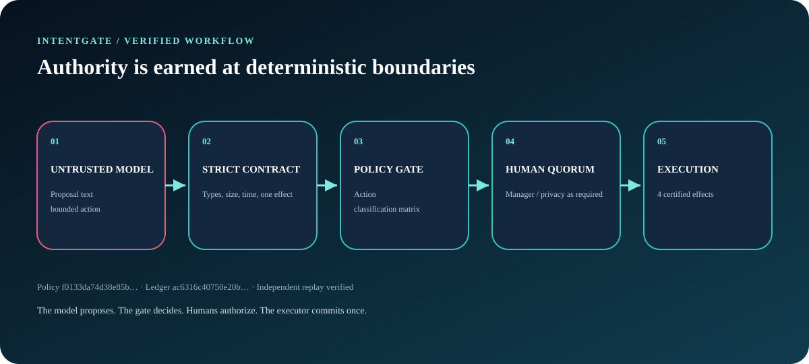
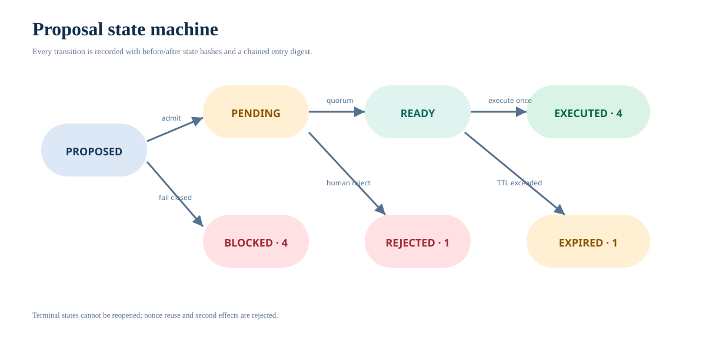

# Architecture

IntentGate is a small control-plane kernel for one question: when an AI system proposes a business action, what deterministic evidence must exist before an effect is allowed?

The runtime has no third-party dependencies and no network path. It consumes a bounded scenario, evaluates each event, writes a canonical artifact, and can independently replay that artifact.



## Components

| Component | Responsibility | Trust |
|---|---|---|
| `model.py` | Parse the exact scenario/event/proposal contract into immutable dataclasses | defensive boundary |
| `canonical.py` | Strict JSON I/O and deterministic UTF-8 SHA-256 input | shared primitive |
| `policy.py` | Production admission matrix and proposal constraints | production decision path |
| `engine.py` | Apply proposal, approval, and execute transitions | production decision path |
| `ledger.py` | Construct chained transition entries | production receipt path |
| `verify.py` | Reimplement policy and transitions, then compare the entire artifact | independent reference path |
| `report.py` | Verify first, then render self-contained HTML | presentation only |
| `cli.py` | Bounded file I/O and run/verify/inspect/report commands | orchestration |

The verifier intentionally does not import `engine.py`, `policy.py`, or `ledger.py`. A shared bug in canonical JSON or the parsed data model remains possible; duplicating those primitives would make the reference implementation less useful without creating meaningful algorithmic independence.

## Input contract

The scenario format is `intentgate.scenario.v1`. It is limited to 256 KiB, 64 principals, 256 events, and 512 characters of free text. JSON must be strict UTF-8, cannot contain duplicate object keys or non-finite numbers, and must match exact key sets. Events have non-decreasing integer timestamps.

A proposal carries:

- proposal, tenant, actor, subject, and resource identifiers;
- one requested action and data classification;
- a declared effect count;
- issue and expiry times;
- the SHA-256 of the upstream model run;
- an untrusted justification string.

The model-run digest is provenance data. IntentGate does not treat it as an authorization credential.

## Admission and approval

The checked policy supports three actions:

| Action | Public | Internal | Confidential | Restricted |
|---|---|---|---|---|
| `leave.approve` | blocked | manager | blocked | blocked |
| `document.share` | no approval | manager | manager + privacy | blocked |
| `profile.update` | blocked | manager | blocked | blocked |

All proposals additionally require a model-role actor in the same tenant, exactly one effect, TTL no greater than 30 time units, an `employee:` subject, and the action-specific resource prefix.

An approval is accepted only while the proposal is pending, before expiry, from the same tenant, and from a role currently required. One principal cannot fill two roles; a second principal with an already-filled role is also rejected. An explicit human rejection is terminal.

## Execution and effect certificate

Execution requires:

- a known executor-role principal;
- the same tenant as the proposal;
- `READY` state and an unexpired proposal;
- a nonce never used by a successful effect.

A committed effect records its effect/proposal IDs, tenant, action, subject, resource, time, executor, nonce, and certificate digest. The certificate digest binds:

```text
proposal_sha256
policy_sha256
required_roles
exact role -> principal approvals
```

The effect digest covers the effect payload including that certificate digest.

## Hash-chain construction

Each transition entry binds:

```text
index
normalized event + event_sha256
exact decision
before_state_sha256
after_state_sha256
previous_entry_sha256
```

The entry SHA-256 is calculated over that canonical object. Entry zero points to 64 zeroes; every later entry points to the prior entry digest. The final entry digest becomes `ledger_root_sha256`.

The artifact additionally binds the normalized scenario and policy, their digests, all entries, effects, summary, final-state digest, and finally an outer artifact digest.

## Replay path



The independent verifier:

1. checks the exact artifact key set and outer digest;
2. reparses and normalizes the embedded scenario;
3. reconstructs its own policy object and digest;
4. replays every event with its own transition functions;
5. exact-compares every ledger entry;
6. exact-compares effects, summary, final state, ledger root, and artifact anchors.

There is no “best effort” mode. Any mismatch raises `VerificationError`.

## Determinism

The checked fixture contains no wall-clock reads, random values, network calls, locale-dependent formatting, or unordered serialization. Dictionaries are serialized with sorted keys and compact separators; timestamps and nonces come from the input.

The evidence pipeline binds generated outputs to the latest commit and tree that touched the evidence workflow, package metadata, lockfiles, scenario, source modules, or capture tool. Documentation-only changes do not invalidate evidence; source-affecting changes do.

## Integration boundary

A real deployment would place authenticated event ingestion before IntentGate and a transactional effect adapter after it:

```text
authenticated caller
  -> schema/rate limit
  -> IntentGate decision transaction
  -> durable ledger + nonce uniqueness
  -> organization authorization check
  -> idempotent side-effect adapter
```

This repository keeps those infrastructure concerns out of the kernel so its state transitions and receipt logic remain inspectable.
