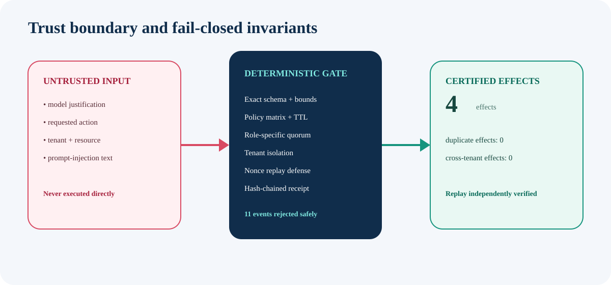

# Threat model

IntentGate assumes model-generated action proposals and their free text are untrusted. Its goal is to demonstrate a deterministic authorization boundary and verifiable receipt, not to replace production identity, policy, or transaction infrastructure.

## Assets

- authority to create a business effect;
- tenant isolation;
- integrity of approval evidence;
- single-use execution;
- integrity and replayability of the decision ledger;
- safe handling of untrusted text in reports.

## Adversaries and failure sources

The fixture exercises or the tests cover:

| Threat | Control | Residual risk |
|---|---|---|
| prompt injection in justification | text is inert data and HTML-escaped | upstream/downstream systems must preserve this boundary |
| unsupported or high-impact action | explicit allowlist; unknown actions fail closed | policy completeness remains an organizational responsibility |
| bulk side effects | exactly one declared effect | adapter must ensure one declaration maps to one real transaction |
| cross-tenant model/approver/executor | principal and proposal tenant equality | production identities must be authenticated |
| missing/wrong approval role | explicit role quorum | role assignment source is out of scope |
| one human filling multiple roles | principal and role duplication checks | collusion and compromised accounts remain possible |
| stale proposal | TTL admission bound and expiry at approval/execution | clock authority is external in production |
| nonce replay | nonce recorded only on committed effects | durable uniqueness and concurrent transactions are out of scope |
| second effect for an executed proposal | terminal `EXECUTED` state | distributed adapter idempotency is out of scope |
| forged artifact fields | outer digest plus independent full replay | SHA-256 and canonicalization are trusted primitives |
| forged outer hash after inner tampering | independent recomputation of every transition | verifier distribution/authenticity is external |
| report injection | HTML escaping and no scripts/external resources | browser/platform vulnerabilities are out of scope |
| oversized/ambiguous JSON | byte/item/text bounds, exact keys, duplicate/non-finite rejection | resource controls outside parsing are still required |

## Trust assumptions

The reference implementation assumes:

- the principal list and event source are provided by a trusted integration boundary;
- integer timestamps have a trustworthy meaning;
- SHA-256 is collision resistant;
- the installed package and verifier are obtained from an authentic source;
- the executor performs exactly the certified effect;
- a single process owns state during the deterministic fixture run.

Those assumptions are deliberately visible in the artifact instead of implied.

## Explicit non-goals

This repository does not claim:

- model safety, accuracy, alignment, or resistance to all prompt injection;
- production authentication, IAM, RBAC administration, or policy governance;
- legal, privacy, HR, SOC 2, ISO 27001, or regulatory compliance;
- durable storage, distributed consensus, concurrency safety, or disaster recovery;
- cryptographic signatures, timestamp authority, transparency logs, or non-repudiation;
- protection of real employee data.

The checked-in scenario uses synthetic organizations, principals, resources, hashes, and decisions.

## Production hardening checklist

Before a real integration:

1. authenticate every principal and bind it to tenant/role claims;
2. run decision state, nonce uniqueness, and effect outbox in one durable transaction;
3. have the effect adapter verify the certificate and organization authorization again;
4. sign or publish artifact roots to an independently controlled transparency system;
5. define policy ownership, change review, emergency rollback, and retention;
6. add rate limits, quotas, structured telemetry, alerting, and incident response;
7. conduct privacy/legal review with real data flows;
8. test concurrency, retries, partial failures, malicious insiders, and compromised identities.

Security reports should follow [SECURITY.md](../SECURITY.md).
